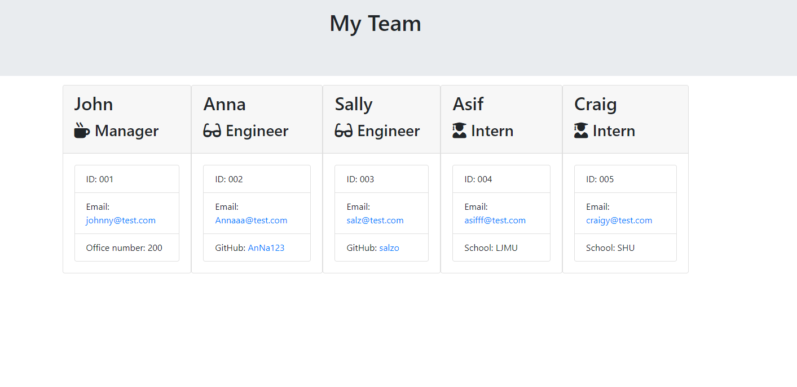

# team-profile-generator

  ## Description
  
  This project created a command-line application to build a project team based on user input. 

  The created HTML page will look something like the following:

  

  ## Table of Contents

  - [Installation](#Installation)
  - [Usage](#Usage)
  - [License](#License)
  - [Contributing](#Contributing)
  - [Tests](#Tests)  
  - [Questions](#Questions)

  ## Installation

  Use the following commands to install any dependencies:

  - npm i inquirer
  - npm i jest

  ## Usage

  The user can run this project from the terminal by running the following command:
  - node index.js
  
  It requires the user to be in the root folder and then they can respond to all prompts with the relevant information.

  ## License

  N/A

  ## Contributing

  N/A

  ## Tests 

  Testing of this project was carried out to ensure the code meets the the acceptance criteria. The user can run the tests by typing the following command into the CLI when in the root folder:

  - npm run test

  All tests passed for this project.

  ## Questsions

  If you have any questions, please contact me on: 

  joshua.crehan@yahoo.com

  Or you can visit my github page:

  https://github.com/JC6991

